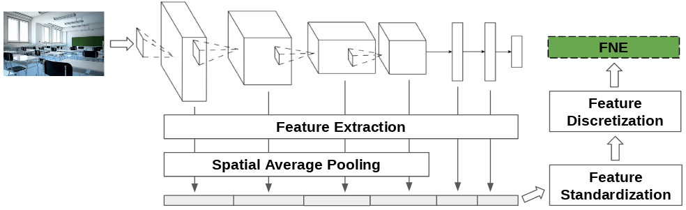

# basic-FNE

Simple code for generating the Full-Network Embedding (FNE) of a dataset using a pre-trained convolutional neural network (CNN) model, as defined in [1].

The Full-Network Embedding is composed by two main steps. First, it extracts the neural activations of a given input using all convolutional or dense layers of the network, thus integrating information at different levels of abstraction (depending on layer depth) and combining different types of neural representations (convolutional and dense layers). Secondly, the FNE contextualizes and leverages this information through a three-valued discretisation step. While the contextualization provides a problem-specific characterisation of the data, the discretization reduces noise and regularises the embedding space. Significantly, this may also reduce the computational cost of processing the resultant representations through methods like SVMs. The FNE is shown to outperform single layer embeddings on several image classification tasks, while also being more robust to the choice of the pre-trained model used as the transfer source. See [1] for more details. The FNE can also be integrated into many multimodal embedding schemes, providing a boost in performance [2].

All FNE functionalities are coded within the "full_network_embedding" method, which extracts and postprocesses the activations of a list of images, as these are feed-forwarded through a given pre-trained CNN. The code contains an example of use, loading a pre-trained model provided by the tensorflow.lucid package.

A straight-forward application of this code is image classification, often through the training of a linear SVM [1]. The FNE is particularly competitive in contexts with little data availability, working with as little as 10 examples per class. The FNE is also robust to dissimilarities between the pre-trained task and the target task, making it apropriate for unusual or highly specific problems.



## Usage
### Prerequisits
This code can be used either in Python3 (up to 3.6.5).
Required packages are `numpy`, `tensorflow`, `opencv-python`, and `lucid` (only needed for loading example model).

### Example
In order to run the example case:
```bash
cd src/
python fne.py
```

### FNE function
If you want to use FNE implementation:
```python
from fne import full_network_embedding
...
fne = full_network_embedding(
    model=_model,
    image_paths=_image_paths, 
    batch_size=_batch_size, 
    input_tensor=_input_tensor, 
    target_tensors=_target_tensors, 
    input_reshape=_input_reshape
)
```
_Positional arguments_:
 - `model` (tf.GraphDef): Serialized TensorFlow protocol buffer (GraphDef) containing the pre-trained model graph from where to extract the FNE. You can get corresponding tf.GraphDef from default Graph using `tf.Graph.as_graph_def`.
 - `image_paths` (list(str)):  List of images to generate the FNE for.
 - `batch_size` (int): Number of images to be concurrently computed on the same batch.
 - `input_tensor` (str): Name of tensor from model where the input is fed to.
 - `target_tensors` (list(str)): List of tensor names from model to extract features from.
 - `input_reshape` (tuple): A tuple containing the desired shape (height, width) used to resize the image.
 
_Optional arguments_:
 - `stats` (2D ndarray): Array of feature-wise means and stddevs for standardization.
 
## References

If you find this code useful, please reference it as:

[1] D. Garcia-Gasulla et al., "An Out-of-the-box Full-Network Embedding for Convolutional Neural Networks," 2018 IEEE International Conference on Big Knowledge (ICBK), Singapore, 2018, pp. 168-175.
doi: 10.1109/ICBK.2018.00030

```
@INPROCEEDINGS{8588789,
author={D. Garcia-Gasulla and A. Vilalta and F. Parés and E. Ayguadé and J. Labarta and U. Cortés and T. Suzumura},
booktitle={2018 IEEE International Conference on Big Knowledge (ICBK)},
title={An Out-of-the-box Full-Network Embedding for Convolutional Neural Networks},
year={2018},
pages={168-175},
keywords={Feature extraction;Training;Computational modeling;Task analysis;Space exploration;Tuning;Transfer Learning, Feature Extraction, Embedding Spaces},
doi={10.1109/ICBK.2018.00030},
month={Nov},}
```
[2] Vilalta, Armand, et al. "Studying the impact of the Full-Network embedding on multimodal pipelines." Semantic Web Preprint: 1-15.

## License
GNU General Public License v2.0

